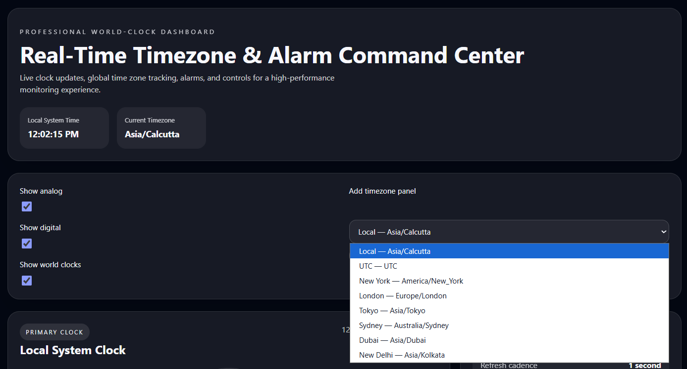
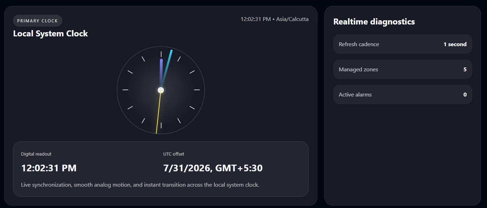
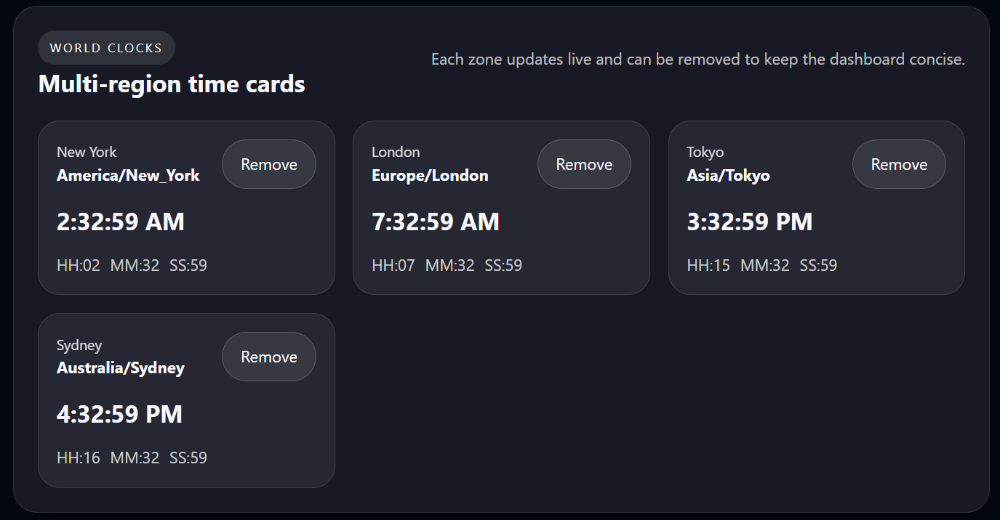
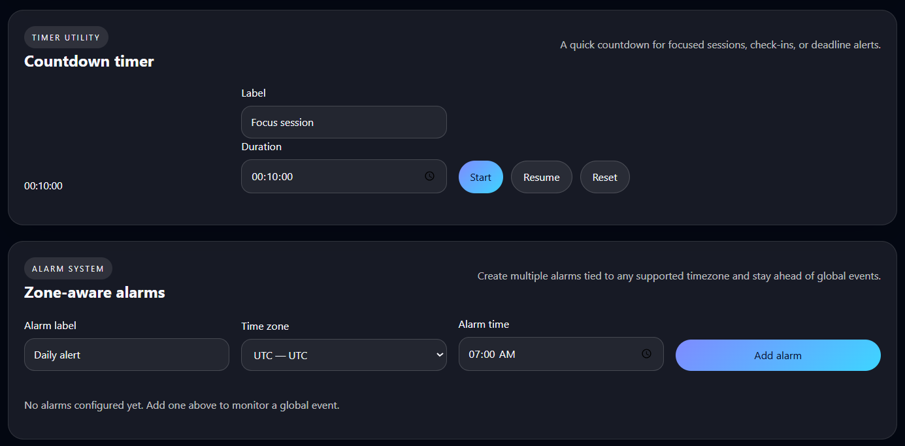

## Real-Time Timezone & Alarm Command Center

This is a React-based web application that allows users to view the current time in different time zones, manage multiple world clocks, set alarms, and use a countdown timer. The project is built using React and Vite with a simple and responsive user interface.

## Features

- View the local system time in real time
- Analog and digital clock
- Add and remove world clocks
- Display time for multiple countries
- Set alarms for different time zones
- Countdown timer
- Responsive user interface

## Screenshots

# Dashboard

The main dashboard displays the current local time, selected time zone, and options to manage different clock panels.



# Local Clock

This section shows the analog clock, digital clock, current date, and UTC offset for the local system.



# World Clocks

Users can add multiple world clocks to monitor different time zones and remove them whenever required.



# Timer and Alarm

This section provides a countdown timer and allows users to create alarms for different time zones.



## Technologies Used

- React
- Vite
- JavaScript
- CSS
- Web Audio API

## Project Setup

Clone the repository:

```bash
git clone https://github.com/suyog2694/Clock_Dashboard_WT.git
```

Go to the project folder:

```bash
cd Clock_Dashboard_WT
```

Install the required dependencies:

```bash
npm install
```

Run the project:

```bash
npm run dev
```

Open the URL displayed in the terminal to view the application in your browser.

## Future Improvements

- Save alarms using local storage
- Add more time zones
- Improve the user interface
- Add a stopwatch
- Add notification support for alarms

## Author

Suyog Marathe